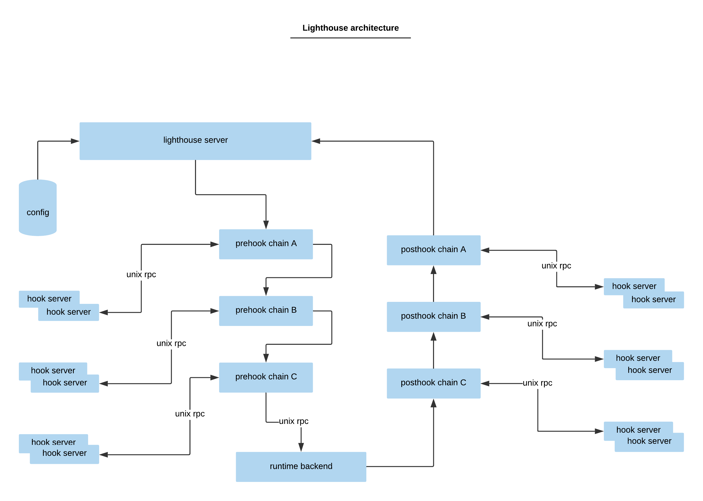

# Summary

Lighthouse is a framework to pre-hook/post-hook runtime request/response. With this hook, we can dynamically add options to any other OCI
 arguments which aren't supported in Kubernetes.

# Architecture



# Hook Configuration

```
apiVersion: componentconfig.lighthouse.io/v1alpha1
kind: HookConfiguration
timeout: 10
listenAddress: unix:///var/run/lighthouse.sock
webhooks:
- name: lighthouse.io
  endpoint: unix://@lighthouse-hook
  failurePolicy: Fail
  stages:
  - urlPattern: /containers/create
    method: post
    type: PreHook
  - urlPattern: /containers/create
    method: post
    type: PostHook
```
