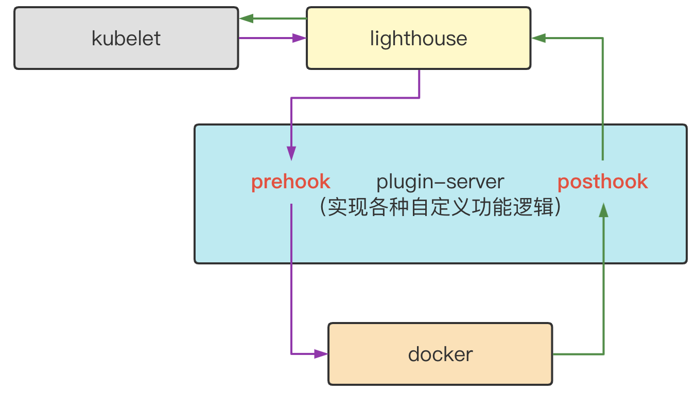
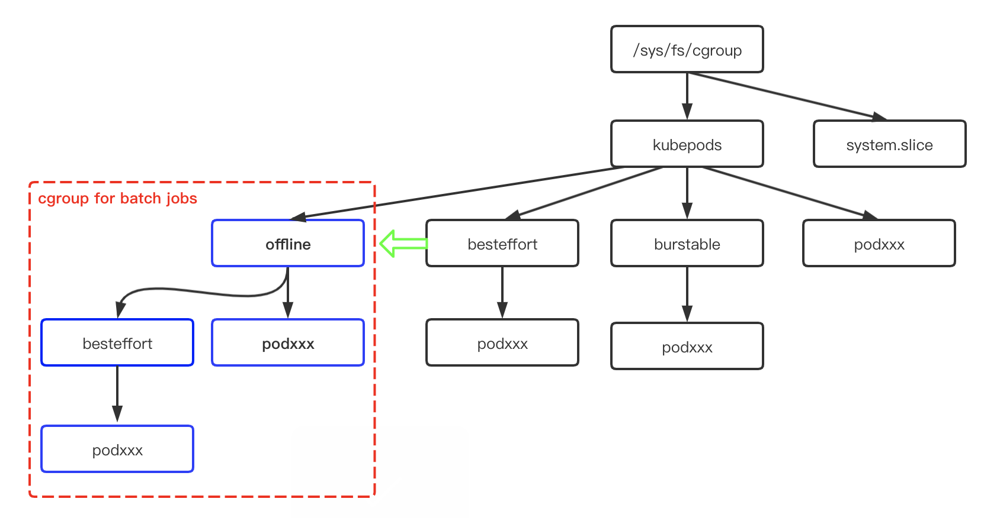
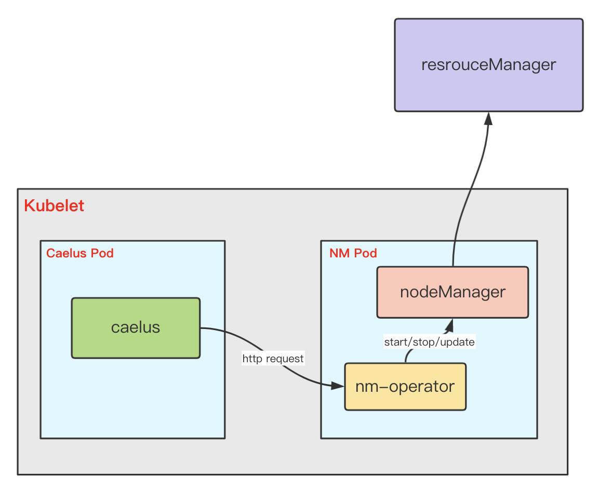

# 编译caelus
（1）编译二进制
```shell
[xx]# make build
[xx]# ll _output/bin/
-rwxr-xr-x 1 root root 51634520 16:28 caelus
-rwxr-xr-x 1 root root 16416404 16:28 lighthouse
-rwxr-xr-x 1 root root 17624320 16:28 nm-operator
-rwxr-xr-x 1 root root 39832989 16:28 plugin-server

其中
caelus:实时计算节点空闲资源，并执行离线资源隔离和资源上报。同时通过干扰检测保证在线服务质量
nm-operator:nodemanager镜像中做为server启动。caelus通过nm-operator提供的api接口来控制nodemanager进程，如启动、停止和修改yarn-site.xml
lighthouse: 转发kubelet的容器请求到docker
plugin-server: 定向对kubelet发送给docker的容器请求参数做适配，如修改cgroup目录
```

（2）编译caelus镜像
```bash
# 或可以直接下载ccr.ccs.tencentyun.com/caelus/caelus:v1.0.0
make image
```

# 编译lighthouse

```bash
# 编译lighthouse二进制
[xx]# cd contrib/lighthouse
[xx]# make
[xx]# ll _output/bin
_output/bin/lighthouse

# 编译lighthouse rpm包
[xx]# make rpm
[xx]# ll _output/RPMS/x86_64
_output/RPMS/x86_64/lighthouse-0.2.1-47.el7.x86_64.rpm

# 编译plugin-server二进制
[xx]# cd contrib/lighthouse-plugin
[xx]# make
[xx]# ll _output/bin
_output/bin/plugin-server

# 编译plugin-server rpm包
[xx]# make rpm
[xx]# ll _output/RPMS/x86_64
_output/RPMS/x86_64/plugin-server-0.3.0-47.el7.x86_64.rpm
```
lighthouse工作流程



# 安装
### 安装lighthouse
(1) rpm -ivh lighthouse-xxx.rpm

(2) 修改配置参数
```yaml
cat > /etc/lighthouse/config.yaml <<EOF
apiVersion: lighthouse.io/v1alpha1
kind: hookConfiguration
timeout: 10
listenAddress: unix:///var/run/lighthouse.sock
webhooks:
- name: docker
  endpoint: unix://@plugin-server
  failurePolicy: Fail
  stages:
  - urlPattern: /containers/create
    method: post
    type: PreHook
  - urlPattern: /containers/{name:.*}/update
    method: post
    type: PreHook
EOF
```

### 安装plugin-server
(1) rpm -ivh plugin-server-xxx.rpm

(2) 修改配置文件
```yaml
cat > /etc/plugin-server/config <<EOF
ARGS="--feature-gates=DockerUTSMode=true,DockerOfflineMutate=true,DockerPidsLimit=true --v=3 --listen-address=unix://@plugin-server --hostname-override=xxx(node name) --kubeconfig=/xxx"
EOF
```

### 修改kubelet参数
```bash
--docker-endpoint=unix:///var/run/lighthouse.sock --docker=unix:///var/run/lighthouse.sock
```

### 启动服务
```bash
systemctl enable plugin-server
systemctl start plugin-server
systemctl enable lighthouse
systemctl start lighthouse
systemctl restart kubelet
```

# 部署caelus
### 配置文件
#### 1、caelus.json
caelus.json文件描述了caelus内置的各个模块配置，其[默认配置](../hack/config/caelus.json)可以让caelus正常运行，但最好是根据业务的实际需求来适配不同的参数。
具体参数说明可参考[caelus配置文件说明](./config.md)

#### 2、rules.json
rules.json文件描述了caelus的干扰检测规则。如cpu检测:
- 首先配置检测算法，如表达式检测（expression），或指数加权平均检测（ewma）
- 若选择expression算法，可配置每隔1分钟检测节点cpu使用率，若连续3次超过90%，或连续5分钟内超过90%，则认为节点当前cpu负载比较高
- 检测到高负载时，便采取禁止调度，及降低离线cpu资源，降低cpu资源按照每2分钟降低1个核
- 若节点cpu恢复正常，则按照每3分钟恢复0.5个核，直至恢复所有之前降低的cpu核数

具体配置参数可参考[干扰检测规则说明](./rules.md)

### 运行caelus
caelus可通过daemonset部署到K8s集群中，pod需要配置某些capabilities，同时需要挂载宿主机根目录到caelus容器中，以便cadvisor可以正常运行。
具体yaml可参考[caelus yaml](../hack/yaml/caelus.yaml)

用户也可以根据需求直接将Caelus运行在宿主机上，这可以通过rpm包进行部署。其运行命令为：

caelus --v=2 --logtostderr --config=/etc/caelus/caelus.json --kubeconfig=xx --hostname-override=xx --insecure-bind-address=xx

若使用diskquota功能，则需要再增加：--docker=unix:///var/run/docker.sock，用于跟docker通信，获取容器的挂载目录

# 在线作业场景
### 1、在线作业为非K8s场景
在线作业直接运行在物理机上，如还未来得及容器化或不适合容器化的在线作业。因Caelus目前是基于K8s平台，所以需要在物理机上部署K8s相关组件，具体如下：

（1）在线作业所在的节点部署K8s slave组件

（2）配置文件caelus.json
- 配置"task_type.online_type"为"local"
- "online.enable"配置为true
- "online.pid_to_cgroup"配置移动在线进程pid到统一cgroup目录下，便于cadvisor收集数据
- "online.jobs"填写跟在线作业相关的信息，其中"online.jobs.command"为在线进程的正则匹配表达式
- 若在线作业有输出指标，可以填写到"online.jobs.metrics"

具体可参考[配置文件说明](./config.md)

（3）提交caelus workload。caelus会自动匹配在线进程，并将其移动到统一cgroup目录下。若在线进程本身就在cgroup目录中，则直接使用现有的cgroup目录

（4）curl http://xxx:10030/metrics | grep online 可查看在线作业的资源使用情况

### 2、在线作业为K8s场景
在线作业直接运行在K8s平台，只需配置"task_type.online_type"为"k8s"即可，Caelus会自动识别在线作业

# 提交离线作业
### 1、离线作业通过kubernetes提交
（1）配置"task_type.offline_type"为"k8s"

（2）pod的annotation增加：
```shell
mixer.kubernetes.io/app-class: greedy (必填)
mixer.kubernetes.io/pids-limit: "xxx" (限制容器内的进程数)
mixer.kubernetes.io/storage-opt-size: "1Gi"(限制容器的rootfs目录大小，要求镜像所在的分区支持diskquota)
mixer.kubernetes.io/uts-mode: "" (host网络模式下，kubelet会把uts namespace也配置为host，通过此参数可以创建一个新的uts namespace)
```

（3）离线pod拉起成功后，其cgroup目录为/sys/fs/cgroup/xx/kubepods/offline,如下图：

### 2、离线作业通过YARN提交
（1）caelus支持YARN，其架构如下。nodemanager需要容器化，并将nm-operator也装入镜像中，nodemanager的yaml可参考
[nodemanager yaml](../hack/yaml/nodemanager.yaml)。容器启动后，nm-operator做为一个server启动（可以把nm-operator当做容器的1号进程）。

（2） 配置"task_type.offline_type"为"yarn_on_k8s"

（3）nodemanager pod的annotation增加：
```shell
mixer.kubernetes.io/app-class: greedy (必填)
mixer.kubernetes.io/pids-limit: "xxx" (限制容器内的进程数)
mixer.kubernetes.io/storage-opt-size: "1Gi"(限制容器的rootfs目录大小，要求镜像所在的分区支持diskquota)
mixer.kubernetes.io/uts-mode: "" (host网络模式下，kubelet会把uts namespace也配置为host，通过此参数可以创建一个新的uts namespace)
```

（4）提交nodemanager pod。caelus会自动通过nm-operator接口拉起nodemanager
