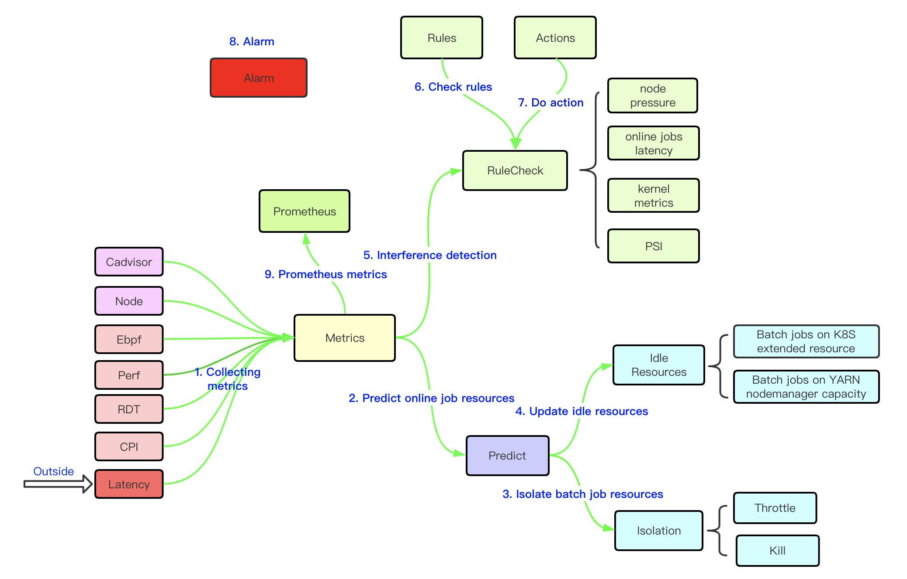

# Caelus tutorial



### 1. Collecting metrics
   Multiple  metrics supported, including cgroup metrics from cadvisor, node resource metrics, kernel metrics from 
   eBPF, hardware events from PMU, and also Caelus collects online jobs latency from outside in the way of executable 
   command or http server.

### 2. Predict resources
   The Predict module aims to predict total resource usage for node, including online jobs, daemon service, such as 
   journald, and kernel modules, such as slab, based on history metrics.  The pod resource recommend algorithm, 
   now using for Horizontal Pod Autoscaler, is adapted for node level. No interaction with other nodes make the agent 
   easy to work.

### 3. Update idle resources
   Idle resources are always following online jobs traffic and not stable. So it is necessary to notify the master 
   how many resources the node could provide for running batch jobs. Caelus will update extended resource value for 
   Kubernetes master, and update NodeManager capacity for YARN master.
   
### 4. Isolation
   Caelus dynamically manages multiple resource isolation mechanisms, such as CPU, memory and disk space, to reduce the 
   contention for shared resources. Batch jobs will be throttled or even killed when resource pressure or 
   latency spike detected.
   
   The resources for running batch jobs could not be managed by kubelet, it is conflicted with CPU manager policy. 
   Caelus creates a new cgroup folder, named "offline", under /sys/fs/cgroup/xx/kubepods, which is out of kubelet's 
   resource management. With the help of [Lighthouse](../contrib/lighthouse/README.md) and
   [Lighthouse-plugin](../contrib/lighthouse-plugin/README.md), batch pids will be automatically migrated into the
   "offline" folder when pods creating.
   
   
   cgroup tree：
```sh
/sys/fs/cgroup/memory/kubepods/
|-- besteffort
|   |-- pod35d69898-f68a-4c4b-9dc9-6eb7267ae4f6
|   |   |-- 2176fd86570b27fd2cd5de39f0c9dccc923a1c4ca6c30749df96304d7f1438bc
|   |   `-- edf4955bc08160d91fa69df892d2f1706f92f1257812d8430599f2864b58a80e
|-- burstable
|   `-- pod968dd5a6-dfcf-47da-8dd2-505dc14fe02e
|       |-- 45b34a665cccd11f0befc8877ff0693eb304a3a6889ad1ac69039c6fbffc60ac
|       `-- 4e7b3a3d0df20779da85c581a4f3efbcfe7044417715ce3b59aa09c4c138957a
|-- offline
|   `-- besteffort
|       `-- pod6955f291-eee4-4cd9-ba84-ae8e23abe9fe
|           |-- e34246a9c17763d3dc01790c08ffca96eca7a762bddee86169d905ae992078a9
|           |   `-- hadoop-yarn
|           |       |-- container_1603784216261_973333_02_047783
|           `-- e5788b73d7db5cc70a8bfe20082f059f0f6be2fc50e02264baae326c10551fec
|-- pod0b921ece-cba0-4b60-ab31-3aef21623986
|   |-- 333b712abb28df53e977024263b30e8a092d06808ac02668ff9eb72dfd3df515
|   `-- dc62b22a47c164686afe1360db8b0d8127db1d8889d0073e5e8d737ee2d39bbe
```

### 5. Interference detection
   Besides resource isolation, Caelus dynamically checks abnormalities of various metrics, such as CPU usage or 
   online latency, to make sure online jobs run normally.  Kinds of detection rules are built to check if the 
   history metrics have significant fluctuations, such as EWMA, and then various actions are taken to throttle batch jobs,
   such as disable scheduling, or decrease idle resources.
   
   Now Caelus supports detecting node pressure metrics, online jobs latency, and kernel metrics which from Ebpf.
   The configuration could be found from [Rules Configuration](rules.md).
   
### 6. Alarm
   Alarm channel is hooked in two ways,  local executable command and post to http server, user can define their own 
   sending codes.   
